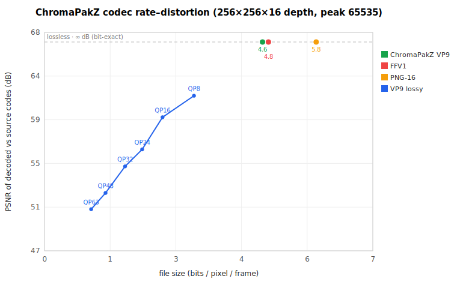

# ChromaPakZ

<p align="center"></p>

**A lossless RGBD video codec** (クロマパックZ): one ordinary `.webm` that carries an 8-bit **RGB** track
alongside **bit-exact 16-bit auxiliary signals** — depth, object IDs, packed normals, or any other `W×H`
`uint16` plane — in sync. It is built so that

- a **legacy player shows plain RGB** — the depth rides in extra tracks a normal player ignores;
- it uses only **royalty-free** codecs (VP9 / libvpx, BSD) — no GPL encoder, no patent pool;
- it runs **in the browser via WebCodecs** — **no WASM on Chromium**, with a small libvpx-WASM fallback for engines whose native path isn't bit-exact; and
- depth is packed with one **reversible map**, not the range-slice bookkeeping of older schemes;
- **multiple lossless uint16 signals** (depth, object IDs, …) share one container in sync.

It's a clean-room redo of an older MP4/x264 approach (RGB as YUV, plus 16-bit depth sliced into several
lossless-10-bit ranges). That design worked but had three thorns: x264 is GPL, the range-slicing was
fiddly, and the browser always needed a WASM codec. ChromaPakZ removes the first two outright; for the
third, Chromium runs end-to-end on WebCodecs with **no WASM**, and a small libvpx-WASM build is kept only
as a per-operation fallback for engines whose native path isn't bit-exact (Firefox, Safari).

The same format is implemented three times — **browser (WebCodecs)**, **C++ (libvpx)**, and **Python** —
and a file written by any one decodes bit-exactly in the others.

## Quickstart

```sh
# Browser demo — encode→file→decode→view, entirely in-page (no WASM on Chromium)
python3 -m http.server 8000      # from the repo root, then open http://localhost:8000/demo/

# Python / C++ — the native libvpx core is compiled from source, so install the build
# prerequisites first: libvpx (dev headers), pkg-config, CMake, and a C++17 compiler.
#   macOS:   brew install libvpx pkg-config cmake ninja
#   Debian:  sudo apt-get install libvpx-dev pkg-config cmake ninja-build g++
pip install .                    # pip compiles the native core via CMake and bundles it
python -c "import chromapakz as cz; print(cz.inverse_depth_spec(0.3, 9.0))"
#   cz.encode({"depth": u16}, specs={"depth": cz.inverse_depth_spec(near, far)}, rgb=rgba)

# Browser JS API — streaming encode/decode (see docs/API.md)
#   createEncoder({ signals: [{ id:'depth', near, far }, { id:'objectId' }] })
#   createDecoder(bytes).readFrame() -> { rgb, signals: { depth: { u16 }, objectId: { u16 } } }

# C++ / CLI
cmake -S . -B build && cmake --build build -j     # or: native/build.sh
./build/dccli selftest
./build/dccli decodesignal clip.webm depth depth.u16
```

## How it works

| Layer | Choice |
|---|---|
| **Container** | WebM / Matroska, multi-track. RGB is track 1, so any player shows it; depth tracks are ignored by players that don't know them. A Duration, a Cues index, and ~1 s RGB keyframes make it **seekable** in `<video>` (depth stays single-keyframe — it isn't what `<video>` plays). |
| **RGB track** | 8-bit VP9, YUV 4:2:0, BT.709 full-range — a normal, viewable video stream. |
| **Lossless signals** | Each signal: optional quant (e.g. inverse-depth for float depth) → **uint16** → **triangle-fold 8+8** → two **VP9 lossless** tracks. Add object IDs, labels, etc. as additional signal pairs. |
| **Metadata** | v2 `signals[]` only — each signal (`id`, tracks, scheme, quant). |

**Inverse-depth quantization** spends precision where it matters (near surfaces), matching how stereo/ToF
sensors behave. Float can't be stored losslessly in 16 bits, so this quantization *is* the format's defined
precision boundary; everything below it is bit-exact.

**Triangle-fold** is the key trick. The naive low byte `d & 0xFF` is a sawtooth — a hard `255→0` cliff
every 256 levels — and those manufactured edges wreck any spatial predictor (this is exactly why the old
design needed range slices). Reflecting every other segment (`lo = (high&1) ? 255-lo : lo`) turns it into a
continuous triangle wave with no cliffs, so VP9's own predictor works. It's range-slicing collapsed into one
reversible map, with nothing to manage.

**Full color range is signaled** in the bitstream (`VP9E_SET_COLOR_RANGE`), so a range-honouring decoder
returns the packed luma unscaled instead of applying a limited-range conversion that would corrupt depth.

### Why these choices (measured, not assumed — Chromium 148)

WebCodecs has no "lossless" switch, so every claim here is a measurement from
`experiments/webcodecs-lossless`:

- **VP9 at QP 0 is bit-exact through WebCodecs; AV1 is not** (AV1 `quantizer:0` drifts by up to ~257). So
  VP9 carries depth; AV1 is fine only for the lossy RGB track.
- **Triangle-fold beats a naive byte-split by ~13%**, and **inter-coding cuts another ~52%** (and stays
  bit-exact across the GOP) — most of what looks like incompressible LSB noise is actually static fold
  structure that temporal prediction removes.
- **8+8 beats high-bit-depth.** 10-bit VP9 encode *is* available in browsers, but a 10+6 split is ~4%
  *worse* than 8+8 and narrows browser reach, so 8+8 wins on both counts.

[`docs/EVALUATION.md`](docs/EVALUATION.md) is the full due-diligence record: every codec/container/packing
alternative considered, the constraint that eliminates each, a head-to-head benchmark (ChromaPakZ beats
FFV1, PNG-16 and x264 on the same 16-bit depth, beats x265/HEVC at matched 11-bit precision, and lands
within 1–2% of LZMA), cited licensing/browser
facts, and a sensitivity analysis of when a different choice would win.

## What it costs

Lossless 16-bit depth of a real sensor is **noise-bound**: the low bits are largely sensor noise, and
lossless coding must preserve every bit of it. On **real Kinect data** (TUM RGB-D `fr1/desk`, 30 frames at
640×480, 78% valid):

| track | bits / pixel |
|---|---|
| RGB | 0.19 |
| depth (hi + lo) | 0.50 + 4.35 |
| **total** | **5.04** |

— depth round-tripped **bit-exact**. Reproduce with `examples/tum_fr1desk.py` (see its header for the
one-line dataset fetch).

The one knob that moves this is the **quantization precision** vs the sensor's noise floor. Spreading depth
over all 65,535 codes makes one step far finer than the noise, so the codec faithfully archives randomness.
Coarsening the grid to match the noise collapses the cost — without losing real signal. The sweep below is
measured on the synthetic benchmark clip (`make_synthetic_rgbd.py`, range ≈0.9–7.8 m) — a separate clip from
the TUM numbers above:

| effective bits | depth precision at 7.8 m | depth bpp |
|---|---|---|
| 16 (default) | 0.9 mm per step | 13.2 |
| 12 | 14 mm per step | 9.7 |
| 11 | 28 mm per step | 8.1 |
| 10 | 56 mm per step | 6.9 |

(Reproduce the bpp column with `python python/benchmark_codecs.py`.) `levels` is a first-class,
metadata-stored parameter (default 65536 = full 16-bit) shared by all three implementations, so
reduced-precision files reconstruct identically everywhere. Set it with `ingest.py --depth-bits N` or the
`levels=` argument.

### Codec rate-distortion

This is a separate axis from precision: how faithfully the *codec* carries whatever quantized depth you
give it. PSNR here is the encode→decode path measured against the source codes.



The lossless codecs all sit on the **∞-dB band** — they reproduce depth exactly and differ only in size,
where ChromaPakZ (VP9) is smallest, just under FFV1, with PNG-16 well behind. The blue curve is ChromaPakZ's
own near-lossless option (sweeping the VP9 quantizer trades fidelity for size), but the default operating
point is **QP 0, bit-exact**. Regenerate with `python python/plot_rd.py`.

> **A note on ffmpeg.** *Decoding* ChromaPakZ files with ffmpeg (or any conformant VP9 decoder) is
> bit-exact. But *encode* with ChromaPakZ, not the ffmpeg CLI: `ffmpeg -c:v libvpx-vp9 -lossless 1` is
> lossless yet **~3× larger** (≈39 vs ≈13 bpp) — same library, far worse coding decisions, and no flag
> tested closes the gap. `python/plot_rd.py` therefore uses the real WebCodecs encoder for the VP9 numbers.

## Cross-language implementations

All three read and write the identical `.webm`, verified bit-exact in every direction (browser ⇄ C++ ⇄
Python), and produce standard files — `ffprobe` reports `matroska,webm` with one RGB stream plus two VP9
streams per lossless signal, and ffmpeg decodes track 0 as plain RGB when present.

Format schema: [`docs/FORMAT.md`](docs/FORMAT.md). API: [`docs/API.md`](docs/API.md).

| Surface | Codec | Build |
|---|---|---|
| **Browser** | WebCodecs VP9 | none — `src/chromapakz.js`, `src/signals.js`, `src/webm.js`. Multi-signal streaming API. |
| **C++** | libvpx VP9 | CMake → `build/_core` + `dccli` (`dc_encode_multi`, `dc_decode_signal`) |
| **Python** | ctypes → C++ | `pip install .` — `encode()`, `decode()`, `parse_metadata()` |

```sh
./build/dccli encodergbd rgb.rgba depth.u16 W H N fps near far kbps out.webm
./build/dccli decodesignal clip.webm objectId ids.u16
./build/dccli decodergb  clip.webm rgb.rgba
```

## Real-data ingestion (`python/`)

- **`ingest.py`** — load depth (`.exr` / `.npy` / `.npz` / 16-bit PNG·TIFF / raw) and optional RGB (image
  sequence, video via ffmpeg, or array), auto-derive inverse-depth `near`/`far` from percentiles, encode,
  and report real per-track bpp. Invalid pixels (`<=0`/NaN) map to code 0.
  `python ingest.py --depth 'd_*.exr' --rgb 'rgb_*.png' -o clip.webm --report --verify`
- **`make_synthetic_rgbd.py`** — a realistic RGBD generator (smooth surfaces, depth edges, disparity-domain
  noise, occlusion shadows, dropout holes) for when you don't have a sensor handy.
- **`webm_inspect.py`** — pure-Python EBML parser for the per-track byte breakdown.

## How it relates to RealSense / Kinect

Depth-camera ecosystems already split into two camps; ChromaPakZ takes the best of both.

- **Intel RealSense** colorizes 16-bit depth into an RGB image (Hue, ~10.5 effective bits) and encodes that
  with a stock H.264/H.265 codec. Great for streaming and reuse of hardware codecs, but **lossy** — unfit
  for ground-truth or archival depth.
- **Kinect / RGBD datasets** store depth raw or as 16-bit PNG. Azure Kinect even records to **Matroska**
  with a 16-bit depth track (lossless via per-frame PNG); TUM RGB-D, NYU and ScanNet use 16-bit PNG
  sequences. Bit-exact, but **intra-only and large** — no temporal compression.

| | RealSense colorize | Kinect / PNG | **ChromaPakZ** |
|---|---|---|---|
| bit-exact 16-bit depth | ✗ (lossy) | ✓ | **✓** |
| RGB plays in any legacy player | ✓ | — | **✓** |
| inter-frame (temporal) compression | ✓ (lossy) | ✗ | **✓ (lossless)** |
| royalty-free, browser-native (no WASM on Chromium) | — | — | **✓** |

That Azure Kinect already chose Matroska — WebM's basis — is telling. ChromaPakZ differs by *compressing*
depth losslessly (VP9 + triangle-fold, inter-coded) rather than storing raw or intra PNG, and by running in
the browser. Sources:
[RealSense colorized depth](https://dev.intelrealsense.com/docs/depth-image-compression-by-colorization-for-intel-realsense-depth-cameras),
[Azure Kinect record format](https://learn.microsoft.com/en-us/azure/kinect-dk/record-file-format).

## Repository layout

```
src/          chromapakz.js, signals.js, webm.js, chromapakz-core.js
native/       chromapakz.{h,cpp}, dccli.cpp
python/       chromapakz/ (pip package), ingest.py, make_synthetic_rgbd.py
demo/         index.html                     in-browser encode→decode→view
examples/     tum_fr1desk.py
experiments/  webcodecs-lossless/            run.mjs, smoke-demo.mjs, headless tests
docs/         FORMAT.md, API.md, EVALUATION.md, RELEASING.md
tests/        roundtrip.py, cross_interop.py, stream_interop.py, ffmpeg_interop.py, js_*.mjs
```

CI builds and tests on Linux + macOS and runs the in-browser VP9-lossless probe in headless Chromium;
`docs/RELEASING.md` covers wheels and PyPI publishing. The full design rationale and benchmarks are in
[`docs/EVALUATION.md`](docs/EVALUATION.md).

## Status & limitations

Working end-to-end and verified across all three implementations. Honest caveats:

- **Browser support is engine-specific** (measured, [`EVALUATION.md` §11](docs/EVALUATION.md)): native
  WebCodecs lossless *encode* is Chromium-only today (WebKit lacks WebCodecs' quantizer mode; Firefox's
  QP 0 isn't lossless); native lossless *decode* works on Chromium and WebKit/Safari, while Firefox
  decodes VP9 to color-converted BGRX. Where native can't be trusted, the library transparently falls
  back to a bundled **libvpx-WASM** codec, chosen *per operation* by a cached runtime probe — so a
  decode-only browser (e.g. Safari) downloads only `vp9-decode.wasm` and never the larger encoder, and
  vice-versa. Force it with `backend: 'webcodecs' | 'wasm'` (default `'auto'`); see [`docs/API.md`](docs/API.md).
  These are Playwright engine builds — reconfirm on shipping browsers before hard claims.
- **"Royalty-free"** reflects the AOMedia/Google position on VP9; Sisvel operates pools that dispute it.
- An **auto precision picker** (estimate the sensor noise floor to choose `--depth-bits`) is future work.
- **Network byte streaming** is supported via `onChunk` on encode and `createDecoder()` + `push()`/`finish()` on decode. See [`docs/API.md`](docs/API.md).
